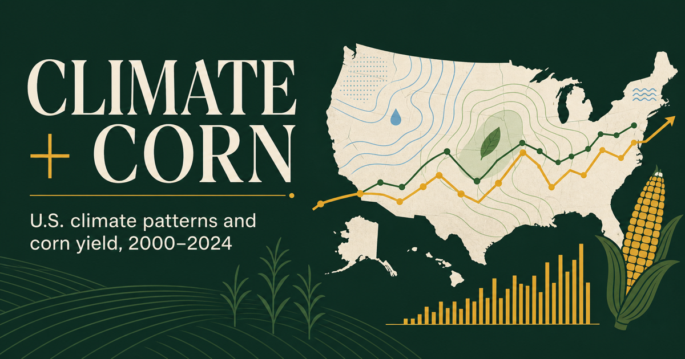
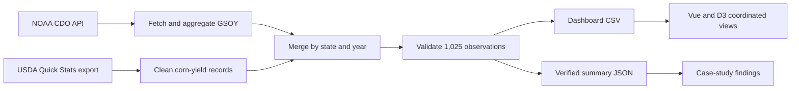

# Climate + Corn Explorer



An interactive data-visualization case study examining how annual temperature
and precipitation are associated with reported corn yield across U.S. states
from 2000 through 2024.

The project combines NOAA Global Summary of the Year climate observations with
USDA NASS Quick Stats corn-yield estimates. Coordinated maps, trends,
scatterplots, rankings, and state-level views let users move between spatial,
temporal, and multivariable perspectives.

> This is an exploratory analysis. Its correlations describe associations in
> the available state-year observations and do not estimate causal climate
> effects.

## Project at a glance

| Coverage | Verified value |
| --- | ---: |
| State-year observations | 1,025 |
| Corn-reporting states | 41 |
| Years | 2000-2024 |
| Temperature-yield Pearson correlation | -0.171 |
| Precipitation-yield Pearson correlation | -0.040 |

All public-facing values are generated from the committed CSV by
[`scripts/validate_dataset.py`](scripts/validate_dataset.py) and stored in
[`public/data/dataset-summary.json`](public/data/dataset-summary.json).

## What users can explore

- Compare average yield, temperature, and precipitation on a U.S. choropleth.
- Filter every coordinated view to a shared year range.
- Select a state from the map, rankings, scatterplots, or global control.
- Compare state-average national and regional trends.
- Inspect pooled temperature-yield and precipitation-yield relationships.
- Brush scatterplot records and examine them in a parallel-coordinates view.
- Open a state deep dive with linked annual charts and descriptive statistics.

## Data and analytical findings

The national state-average corn yield was 28 bushels per acre higher in 2024
than in 2000. Over the same endpoints, the national state-average annual
temperature was 2.36°F higher.

The pooled state-year correlations are weak:

- Temperature and yield: `r = -0.171`
- Precipitation and yield: `r = -0.040`

These coefficients combine persistent differences between states with changes
within states over time. Technology, irrigation, soil, crop genetics, growing-
season timing, and farm practices are not controlled. See the full
[`methodology and limitations`](docs/METHODOLOGY.md) before interpreting the
results.

## Architecture



The interface is built with Vue 3, D3.js, TopoJSON, and Vite. Python scripts
using pandas and requests reproduce and validate the data workflow.

## Run the dashboard

Use Node.js 20.19+ or 22.12+. The repository includes an `.nvmrc` for the
recommended version.

```bash
nvm use
npm ci
npm run dev
```

Create an optimized production build with:

```bash
npm run build
```

## Reproduce the data workflow

The NOAA API requires a personal token, and the USDA source is a manual Quick
Stats CSV export. Secrets and raw downloads are intentionally excluded from
Git.

```bash
python -m venv .venv
source .venv/bin/activate
pip install -r requirements.txt

export NOAA_CDO_TOKEN="your-personal-token"
python scripts/fetch_noaa.py
python scripts/clean_usda.py --input data/raw/usda_quick_stats_corn_yield.csv
python scripts/build_dataset.py \
  --climate data/interim/noaa_state_climate_2000_2024.csv \
  --yield-data data/interim/usda_corn_yield_2000_2024.csv
python scripts/validate_dataset.py
```

Detailed filters, aggregation choices, schema definitions, and limitations are
documented in [`data/README.md`](data/README.md) and
[`docs/METHODOLOGY.md`](docs/METHODOLOGY.md).

## Quality checks

```bash
npm run validate:data
npm run test
npm run build
```

`npm run check` runs the complete sequence. GitHub Actions repeats it on pushes
and pull requests.

## Data sources

- [NOAA Climate Data Online API v2](https://www.ncei.noaa.gov/cdo-web/webservices/v2)
- [NOAA Global Summary of the Year documentation](https://www.ncei.noaa.gov/pub/data/cdo/documentation/GSOY_documentation.pdf)
- [USDA NASS Quick Stats](https://www.nass.usda.gov/Quick_Stats/)
- [USDA NASS developer resources](https://www.nass.usda.gov/developer/)

## Project team and origin

Developed collaboratively by **Manikanta Macha** and **Yashwanth Kumar
Mogili**. The first version was created for Interactive Data Visualization at
the University of Iowa in Fall 2025 and subsequently revised as a portfolio
case study.
